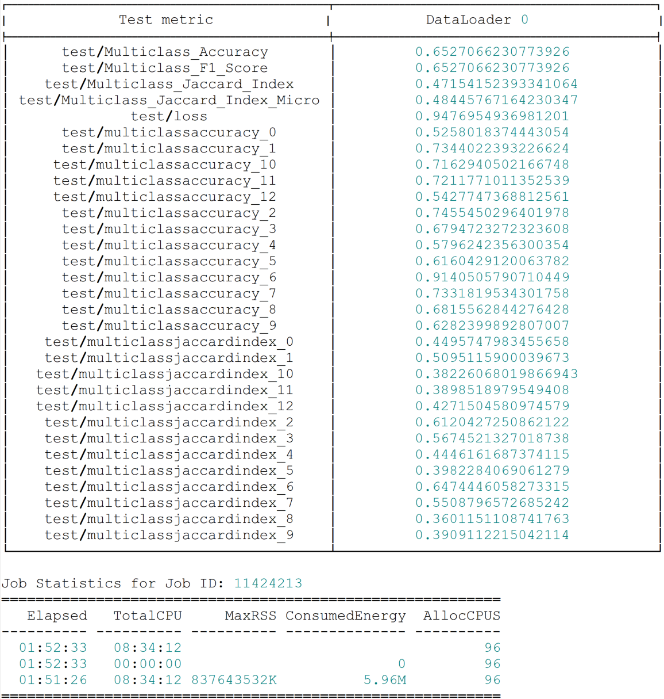

= Geospatial MLOps Pipeline Documentation
This documentation covers the code artifacts created as part of my Master's Thesis at Reutlingen University and IBM Research Zurich. 
:toc:

== System Design 
The geospatial MLOps pipeline is designed to efficiently, reliably, and reproducibly evaluate geospatial Foundation Models (geoFMs).
It utilizes three individual downstream tasks to assess generalizability, seamless HPC integration to handle compute-intensive fine-tuning jobs, and extensive versioning of all resulting artifacts using Git and DVC. 

.The pipeline consists of three main software components:
* link:cicd-pipeline/.gitlab-ci.yml[CI/CD pipeline]
* link:config-file/config.env[Pipeline config file]
* link:orchestration-agents[Cluster-side orchestration agent]

.And four hardware components:
* Local machine (dev environment)
* CI/CD runner (In this case, a privately hosted Gitlab runner is used)
* Storage (In this case, a Cloud Object Store (COS))
* High Performance Computing (HPC) cluster

The UML activity diagram below visualizes the pipeline flow across the hardware components.

.Pipeline flow across hardware components.

[[datasets]]
== Datasets
This section lists the downstream tasks and corresponding datasets used in the automated evaluation of geoFMs within this pipeline.

.Downstream task : dataset
* Multi-temporal crop classification : link:https://huggingface.co/datasets/ibm-nasa-geospatial/multi-temporal-crop-classification[multi-temporal-crop-classification] 
* Landslide detection : link:https://huggingface.co/datasets/ibm-nasa-geospatial/Landslide4sense[Landslide4sense]
* Above-ground biomass estimation : link:https://drive.google.com/file/d/1k-SuberK2iq1NpiP1e9puNp7RVlg7I-X[granite-geospatial-biomass-dataset] 

== Prerequisites
This section lists the prerequisites needed to run the automated geospatial MLOps pipeline for geoFM evaluation.

.Local machine
. Clone the git repository to your local machine
. Make sure to pull the latest commit before pushing changes to the config file 

.CI/CD pipeline
. Place the pipeline definition (.gitlab-ci.yml or equivalent) in the same repository as the rest of the code so it gets triggered whenever there are new commits
. Insert your custom parameters (S3 endpoint etc.) into the pipeline definition
. Set up secrets (S3 credentials) as CI/CD variables so they can be accessed by the pipeline

.HPC cluster
. Install ``TerraTorch`` (tested on version 1.0) via pip
. Install ``dvc[s3]`` via pip
. Install ``dotenv`` via pip
. Clone the git repository to a directory on the cluster
. Set up secrets (S3 credentials, Gitlab access token) as masked environment variables on the cluster
. Make sure all datasets are downloaded/transferred to the cluster and insert the respective dataset paths in the pipeline config file (see the xref:datasets[Datasets] section for links to the datasets)
. Update the bash-job creation step of the orchestration agent script to match your cluster setup (working examples for SLURM and Spectrum LSF cluster can be found link:orchestration-agents[here])

== Running the Pipeline
A typical pipeline run looks like this: 

.Steps
. Start the cluster-side orchestration agent by navigating to the respective path within the cloned repository on your HPC cluster and running this command: ``python worker.py`` 
. Update the link:config-file/config.env[config file] according to your needs (e.g., plug in a different Prithvi-EO version for evaluation or change the number of workers to fit your system)
. Commit your changes to the config file using a descriptive commit message for later reference (e.g., "Experiment 1: Prithvi-EO v2 300M, 20 epochs")
. Push your changes to the remote repository to trigger a CI/CD pipeline run
. The CI/CD pipeline will now push your updated config to the specified COS, triggering the cluster-side orchestration agent
. Once the agent orchestrated all downstream fine-tuning jobs on the cluster, it will automatically version the resulting outputs using DVC and push them to the specified remote 
. The CI/CD pipeline will pull the results, access rather the run was sucessful and set its exit status accordingly
. Once you see that the pipeline has exited with status 0 (success), you can pull the latest commit using ``git pull`` and synchronize your local DVC-versioned files using ``dvc pull``   
. You can now manually examine error files in the /err dir, outputs (including model performance metrics and resource usage statistics) in the /out dir, and plotted sample predictions in the /predictions dir
. To reproduce any previous pipeline run, simply look for the desired commit in the ``git log`` and ``git reset --hard`` to that commit, followed by another ``dvc pull`` to synchronize the DVC-versioned files

== Example Outputs 
The pipeline produces three main outputs, depending on the experiment's success: 

.Artifacts
. Error files, forwarding potential errors that occurred on cluster-side when running the fine-tuning jobs
. Output files, including model performance metrics and resource usage statistics 
. Plotted predictions for a random selection of samples

Below are examples of these artifacts, produced by the automated evaluation pipeline.

.Example of error file for experiment with faulty augmentations to the test set.

.Example of outputs including downstream model performance and resource usage statistics for Prithvi-EO v2 300M, fine-tuned to the classification downstream task for 60 epochs.

.Example of plotted predictions, Prithvi-EO v2 300M, fine-tuned to the classification downstream task for 60 epochs.

.Example of plotted predictions, Prithvi-EO v2 300M, fine-tuned to the segmentation downstream task for 60 epochs.

.Example of plotted predictions, Prithvi-EO v2 300M, fine-tuned to the regression downstream task for 60 epochs.
image::figures/regression-sample.png[]